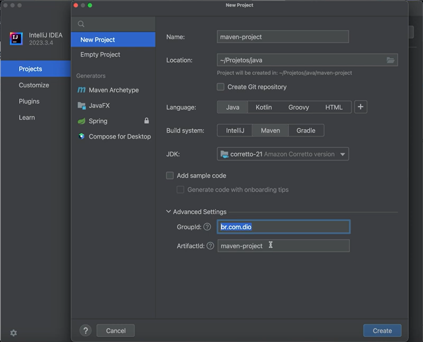

# 🛠️ Instalando o Maven com SDKMAN! e Criando Projetos Java 🚀
## Bem-vindo ao Mundo do Maven! 🌍
Imagine que estamos embarcando em uma jornada pelo universo do desenvolvimento Java, e nossa primeira parada é o poderoso Maven! Mas antes de começarmos a criar nossos projetos incríveis, precisamos configurar tudo direitinho. Bora lá?

## 🔧 Instalando o Maven com SDKMAN!
Já imaginou instalar ferramentas como quem pede comida por aplicativo? Pois é, o SDKMAN! facilita nossa vida desse jeito! Com ele, instalar o Maven é um passeio no parque.

### 📌 Passo 1: Verificando se o SDKMAN! está instalado
Abra o terminal e digite:

``sdk version``
Se aparecer um número de versão, ótimo! Caso contrário, precisamos instalar o SDKMAN! primeiro.

### 📌 Passo 2: Instalando o Maven
Agora, só precisamos rodar este comando mágico:


``sdk install maven``

Depois de alguns segundos, o Maven estará prontinho no seu sistema! Quer conferir? Digite:

``mvn -version``

#### 🎉 Pronto! Seu ambiente já está configurado!

## 🚀 Criando um Projeto Maven do Zero


Agora que temos o Maven instalado, que tal criar um projeto? É como montar um foguete para explorar o espaço do Java!

## 📌 Passo 1: Escolhendo o local do projeto
Primeiro, abra o terminal e navegue até a pasta onde deseja criar o projeto:


``cd ~/meus-projetos``

## 📌 Passo 2: Criando o projeto com Maven
Agora, rodamos o comando abaixo para gerar a estrutura do nosso projeto:


````mvn archetype:generate -DgroupId=com.exemplo -DartifactId=meu-projeto -DarchetypeArtifactId=maven-archetype-quickstart -DinteractiveMode=false````

Isso cria uma estrutura de diretórios completa com um Hello World em Java prontinho para ser compilado e rodado.

###  🖥️ Abrindo o Projeto no VS Code ou IntelliJ IDEA
## 📌 Se você usa o VS Code, entre na pasta do projeto e execute:

``code .``

### 📌 Se prefere o IntelliJ IDEA, basta abrir o programa, selecionar "Open" e escolher a pasta do projeto.

#### 🎯 Agora é só começar a codar! O Maven já configurou tudo para você!

## 📦 Adicionando Dependências ao Projeto
Um dos superpoderes do Maven é gerenciar dependências. Quer usar bibliotecas externas? Basta adicioná-las no arquivo pom.xml!

Por exemplo, para adicionar a biblioteca MapStruct (para mapeamento de objetos), incluímos:

```
<dependencies>
    <dependency>
        <groupId>org.mapstruct</groupId>
        <artifactId>mapstruct</artifactId>
        <version>1.5.3.Final</version>
    </dependency>
</dependencies>
```

Depois, só rodar:


``mvn install``

E pronto! O Maven baixa e gerencia tudo para nós.

