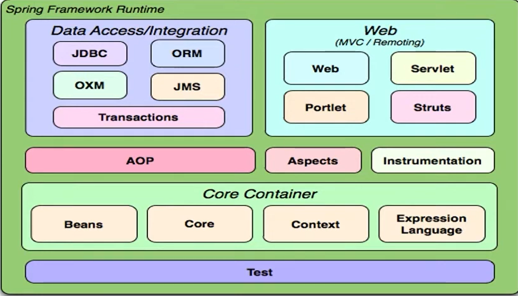

# Slides

A apresentação completa utilizada neste módulo está disponível [AQUI](https://docs.google.com/presentation/d/1VfMegq5Je5qO4IP8chi2x4YR4ACOfBbN/edit#slide=id.p2)

Com isso, você terá acesso a todos os slides e links explorados durante as aulas.

## Spring Framework Fundamentos
 

### O que é Spring Framework
O Spring Framework é uma plataforma open-source para o desenvolvimento de aplicativos em Java. Criado para simplificar o desenvolvimento de aplicações corporativas, o Spring oferece uma estrutura leve e modular que ajuda a gerenciar a complexidade e a produtividade ao criar sistemas robustos. Ele facilita tarefas comuns como a configuração de uma aplicação, segurança, transações e acesso a banco de dados, entre outros.

A principal proposta do Spring é fornecer um framework flexível e simples para criar aplicativos corporativos, com menos complexidade em comparação com outras opções tradicionais como Java EE.

- Spring Versus Java EE
- Conceito de Inversão de Controle


### Injeção de Dependências (DI)
É  um padrão de design utilizado no Spring que promove o desacoplamento entre as classes. A **DI** permite que um objeto não precise se preocupar com a criação de suas dependências, sendo estas injetadas pelo container Spring.

Existem três formas principais de realizar a injeção de dependências no Spring:
- **Injeção por Construtor**: As dependências são passadas por meio do construtor da classe.
- **Injeção por Setter**: As dependências são injetadas através de métodos setters.
- **Injeção via Anotação**: A dependência é automaticamente injetada usando anotações como `@Autowired`.


### Beans \ Autowired \ Scopes
- **Beans**: No contexto do Spring, um **bean** é simplesmente um objeto que é instanciado, configurado e gerido pelo container Spring. Cada bean é configurado através de XML ou anotações, como `@Component`, `@Service`, `@Repository`, e `@Controller`.
  
- **Autowired**: A anotação (indicação)`@Autowired` é usada para realizar a injeção de dependência automaticamente. Quando o Spring encontra essa anotação, ele injeta a dependência requerida no bean.

    ```java
    @Service
    public class UserService {
        @Autowired
        private UserRepository userRepository;
        
        // outros métodos
    }
    ```
    -  **byName** : Busca um método  set que corresponde ao nome do Bean. 
    -  **byType**: Tipo de classe / instância para inclusão do Bean.
    - **byConstructor**:Para incluir uma dependencia.
- **Scopes**: No Spring, os beans podem ter diferentes escopos, que definem o tempo de vida do bean e a quantidade de instâncias criadas. 


#### Os principais escopos são:
  - **Singleton** (padrão): Uma única instância do bean é criada e compartilhada em toda a aplicação.
  - **Prototype**: Uma nova instância do bean é criada toda vez que é solicitada.
  - **Request**: O bean é criado uma vez por requisição HTTP.
  *Os objetos existirão enquanto a requisição estiver em execução*
  - **Session**: O bean é criado uma vez por sessão HTTP.
  *Precisamos acessar a mesma solicitação duas vezes para testar os escopos especificosda web*
  - **HTTP Global**: Escopo da aplicação, cria uma bean para o contexto do ciclo de vida do contexto da aplicação.
  *Objetos compartilhados por toda a aplicação*
- Projeto Springboot


