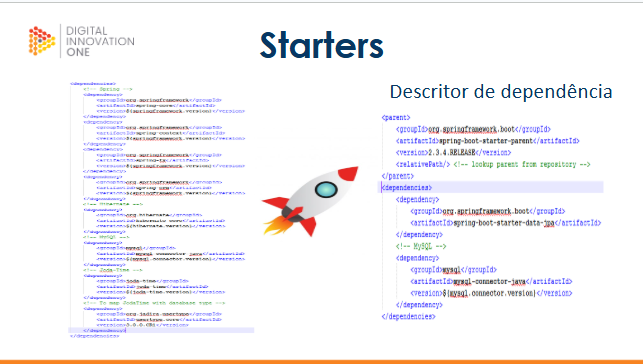

## Aula 2: Springboot
A apresentação completa utilizada neste módulo está disponível [AQUI](https://docs.google.com/presentation/d/1jS5Ov8UCSnzgW3TLBcAsGrXo__kL6FOG/edit#slide=id.p3)

## Spring Framework Projeto Springboot

- O que é Springboot ?
- Configurações manuais
- Starters
- Principais Starters
- Configuração de fábrica

# Spring Framework e Projeto Spring Boot

## O que é Spring Boot?

Spring Boot é um projeto do **Spring Framework** que simplifica o processo de configuração e desenvolvimento de novas aplicações baseadas no Spring. Ele tem o objetivo de minimizar a quantidade de configuração necessária e acelerar o desenvolvimento. Isso significa que, ao usar o Spring Boot, você pode criar aplicações Java de forma mais rápida e simples, sem precisar se preocupar muito com detalhes complexos de configuração.

Se você já usou o Spring antes, deve ter percebido que ele exige várias configurações manuais para funcionar, mas com o Spring Boot, muitas dessas configurações já estão prontas e você só precisa se preocupar em desenvolver a lógica da sua aplicação.

Uma das grandes vantagens do Spring Boot é que ele vem com um **servidor embutido** (como o Tomcat), o que facilita bastante o desenvolvimento, pois você pode rodar a aplicação localmente sem precisar configurar um servidor externo.

## Configurações Manuais

Embora o Spring Boot tenha como objetivo facilitar a configuração da sua aplicação, em alguns casos, você pode querer personalizar algumas configurações manualmente. Felizmente, isso é muito simples de fazer. O Spring Boot utiliza arquivos **application.properties** ou **application.yml** para centralizar a configuração da sua aplicação.

Esses arquivos permitem que você defina configurações como a porta que o servidor vai rodar, conexões com banco de dados, segurança, entre outras. O legal é que você pode usar valores padrão, ou sobrescrever essas configurações com base nas suas necessidades.

Por exemplo, se você quiser mudar a porta padrão (8080) para 9090, basta adicionar a linha abaixo no seu **application.properties**:

```properties
server.port=9090

```

# Starters

No Spring Boot, **Starters** são coleções de dependências que facilitam a configuração da sua aplicação. Eles são usados para incluir todas as dependências necessárias de uma funcionalidade específica sem que você precise se preocupar em adicionar uma por uma.

Por exemplo, se você precisa de suporte para trabalhar com um banco de dados, você pode usar o Starter `spring-boot-starter-data-jpa`, que incluirá automaticamente as dependências do Spring Data JPA, Hibernate e outros componentes necessários para você interagir com bancos de dados.

Em resumo, os Starters tornam o gerenciamento de dependências muito mais fácil no Spring Boot.

## Principais Starters

Aqui estão alguns dos **principais starters** que você pode utilizar para adicionar funcionalidades específicas à sua aplicação Spring Boot:

- **spring-boot-starter-web**: 
  - Usado para criar aplicações web, incluindo APIs RESTful. Ele inclui o Tomcat embutido, além de bibliotecas como Spring MVC, Jackson (para manipulação de JSON) e outras dependências relacionadas a web.
  
- **spring-boot-starter-data-jpa**: 
  - Usado para trabalhar com JPA (Java Persistence API) e bancos de dados relacionais. Ele traz as dependências necessárias para integrar seu aplicativo com bancos de dados como MySQL, PostgreSQL, H2, entre outros.
  
- **spring-boot-starter-thymeleaf**:
  - Usado para integrar o motor de templates Thymeleaf à sua aplicação. Ele facilita a renderização de páginas HTML e é bastante popular em aplicações web.
  
- **spring-boot-starter-security**: 
  - Usado para adicionar segurança à sua aplicação. Ele integra o Spring Security, proporcionando autenticação, autorização e proteção contra ataques comuns.
  
- **spring-boot-starter-test**: 
  - Usado para configurar o ambiente de testes. Inclui bibliotecas como JUnit, Mockito, Spring Test, etc., para que você possa escrever testes automatizados para sua aplicação.

- **spring-boot-starter-logging**:
  - Esse Starter fornece suporte para logging na sua aplicação com o Logback, uma ferramenta poderosa para registrar logs de maneira eficaz.

Esses são apenas alguns exemplos, mas existem muitos outros Starters disponíveis no Spring Boot, que permitem adicionar funcionalidades de maneira fácil e rápida.

## Configuração de Fábrica

No Spring Boot, a **Configuração de Fábrica** é o processo pelo qual o Spring cria e configura automaticamente os componentes da aplicação. A configuração de fábrica torna o Spring Boot um dos frameworks mais fáceis de usar, pois muitas configurações são feitas de forma automática, sem precisar de um arquivo XML ou uma classe de configuração extensa.

A configuração de fábrica ocorre principalmente através da anotação `@SpringBootApplication`, que você coloca na classe principal da sua aplicação. Essa anotação é uma combinação de outras anotações, como `@Configuration`, `@EnableAutoConfiguration` e `@ComponentScan`, o que torna o Spring Boot capaz de detectar automaticamente os beans, realizar a configuração e até mesmo configurar um servidor embutido como o Tomcat.

Por exemplo, uma classe principal de uma aplicação Spring Boot ficaria assim:

```java
@SpringBootApplication
public class Application {
    public static void main(String[] args) {
        SpringApplication.run(Application.class, args);
    }
}

```

# Para saber mais

- [The Difference Between Spring Framework vs. Spring Boot](https://www.fusion-reactor.com/blog/the-difference-between-spring-framework-vs-spring-boot/)

- [Spring Vs Spring Boot: Brief Overview and Comparison](https://dev.to/eduwyre/settling-spring-vs-spring-boot-debate-8ek )

- https://www.reply.com/solidsoft-reply/en/content/webservices-soap-and-rest-a-simple-introduction 

- [Spring Vs Spring Boot: Brief Overview and Comparison](https://www.geeksforgeeks.org/difference-between-spring-and-spring-boot/) 

