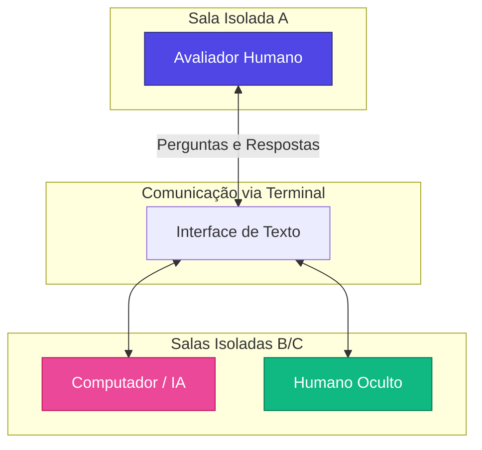
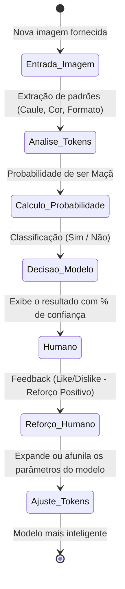

# 🎓 Curso: Introdução à Inteligência Artificial
## Módulo 1 — Fundamentos da IA Moderna: Machine Learning, LLMs, IA Generativa e Agentes

**Instrutor:** Felipe Aguiar  
**Especialidade:** Especialista Fullstack e Coordenador de Educação  
**Data da Aula:** 21/06/2026  
**Duração Estimada:** 45 minutes  

---

## 📚 Índice
1. [Introdução e o Teste de Turing](#1-introdução-e-o-teste-de-turing)
2. [O Nascimento do Termo "Inteligência Artificial" (1956)](#2-o-nascimento-do-termo-inteligência-artificial-1956)
3. [ELIZA: O Primeiro Chatbot do Mundo (1966)](#3-eliza-o-primeiro-chatbot-do-mundo-1966)
4. [Evolução dos Modelos de Linguagem e IA Corporativa](#4-evolução-dos-modelos-de-linguagem-e-ia-corporativa)
5. [Como a IA é Treinada: A Didática das Maçãs](#5-como-a-ia-é-treinada-a-didática-das-maçãs)
6. [LLMs vs. SLMs: Entendendo os Modelos de Linguagem](#6-llms-vs-slms-entendendo-os-modelos-de-linguagem)
7. [Tabela Comparativa: ML vs. DL vs. IA Generativa](#7-tabela-comparativa-ml-vs-dl-vs-ia-generativa)
8. [Referências, Recursos e Materiais Recomendados](#8-referências-recursos-e-materiais-recomendados)

---

## 1. Introdução e o Teste de Turing

A ideia de que computadores podem simular conversas humanas e raciocinar não é recente. Suas origens remontam ao ano de **1950**, quando o matemático e criptoanalista britânico **Alan Turing** publicou o artigo científico *"Computing Machinery and Intelligence"*. Nesse artigo, Turing propôs uma pergunta central: **"Os computadores podem pensar?"**

Para responder a isso de forma prática, ele desenvolveu o **Teste de Turing**, originalmente chamado de **O Jogo da Imitação** (que também dá nome ao aclamado filme biográfico sobre Turing).



### Funcionamento do Jogo da Imitação:
1. Um avaliador humano fica em uma sala fechada e se comunica por meio de um terminal de computador com outras duas entidades em salas separadas: um humano e uma máquina.
2. O avaliador faz perguntas por escrito de forma livre.
3. Se, após uma série de perguntas e diálogos, o avaliador não conseguir identificar com certeza quem é a máquina e quem é o ser humano, o computador passa no teste, provando sua capacidade de simular o comportamento inteligente humano.

> [!NOTE]
> Na década de 1950, a crítica comum à ideia de Turing era que computadores sempre seriam limitados a regras lógicas estritas e condicionais pré-programadas do tipo **IF/ELSE** (`Se o usuário digitar X, responda Y`), o que impossibilitaria a flexibilidade de uma conversa natural humana. No entanto, Turing identificou que as conversas humanas do dia a dia seguem padrões estatísticos de probabilidade que poderiam ser imitados e previstos.

### Referências na Cultura Pop:
* **Blade Runner (1982):** O teste *Voight-Kampff*, usado para identificar replicantes (androides) em meio aos humanos, é uma versão futurista do Teste de Turing adaptada para avaliar respostas emocionais e dilatação de pupilas.
* **Livro "Androides Sonham com Ovelhas Elétricas?" (Philip K. Dick):** Livro que deu origem a Blade Runner, que discute as barreiras da empatia e da capacidade de máquinas sonharem ou pensarem.

---

## 2. O Nascimento do Termo "Inteligência Artificial" (1956)

Após a semente plantada por Turing, o campo de pesquisas continuou a crescer. Em **1956**, durante a histórica **Conferência de Dartmouth** nos Estados Unidos, o cientista da computação **John McCarthy** propôs formalmente o termo **Inteligência Artificial (IA)**.

McCarthy argumentou que o termo descrevia a ciência e a engenharia de criar máquinas inteligentes, simulando a inteligência humana por meio de mecanismos artificiais capazes de aprender de forma dinâmica, indo muito além de dicionários fixos e estáticos de perguntas e respostas.

---

## 3. ELIZA: O Primeiro Chatbot do Mundo (1966)

Em **1966**, dez anos após a definição do termo IA, o professor do MIT **Joseph Weizenbaum** criou o primeiro chatbot da história: **ELIZA**. 

O grande objetivo da ELIZA era permitir que humanos interagissem com computadores usando sua própria **linguagem nativa** (no caso, o inglês), em vez de códigos de programação. Esse foi o nascimento prático do **Processamento de Linguagem Natural (PLN / NLP)**.

```
      Humano: "Eu me sinto triste."
      ELIZA:  "Por que você se sente triste?"
      Humano: "Minha mãe não me compreende."
      ELIZA:  "Fale-me mais sobre a sua mãe."
```

### O Funcionamento da ELIZA:
* Operava como uma **Psicoterapeuta Rogeriana** (terapia centrada no cliente), que devolve as declarações do paciente em forma de perguntas reflexivas.
* Utilizava regras de **substituição probabilística de palavras-chave**. Se o usuário dizia "triste", ela buscava no dicionário a regra de resposta correspondente e substituía a palavra pelo contexto ("Por que você está triste hoje?").
* Ela aprendia e ampliava seu vocabulário de forma dinâmica a partir das interações com os usuários.


> [!WARNING]
> **O Efeito ELIZA:** Weizenbaum percebeu com preocupação que as pessoas criavam laços emocionais com o programa de computador, acreditando que a ELIZA de fato as compreendia e tinha sentimentos humanos (antropomorfização). Esse fenômeno acendeu os primeiros debates sobre ética e psicologia no uso de assistentes artificiais.
>
> *Referência do Cinema:* O filme **[Her (Ela - 2013)](https://tv.apple.com/br/movie/ela/umc.cmc.3y44q428nffh01k7j92lrcjqm)** (consulte também a disponibilidade de plataformas de streaming brasileiras via **[JustWatch](https://www.justwatch.com/br/filme/her)**) retrata o Efeito ELIZA elevado ao extremo, onde o protagonista se apaixona por um sistema operacional baseado em IA generativa.

---

## 4. Evolução dos Modelos de Linguagem e IA Corporativa

Com o passar das décadas, os experimentos de NLP e chats evoluíram significativamente:

* **1972 — PERRY (Kenneth Colby, Stanford):** Um chatbot modelado para simular o comportamento de um paciente com esquizofrenia paranoica. PERRY era mais complexo que a ELIZA, e o teste de Turing foi aplicado colocando psiquiatras reais para entrevistá-lo sem saber se era humano ou máquina.
* **1984 — RACTER:** Um gerador autônomo de textos que "escreveu" o livro comercial *"The Policeman's Beard is Half Constructed"*. RACTER montava frases analisando a estrutura gramatical e a probabilidade de palavras-chave extraídas de best-sellers.
* **2011 — IBM Watson:** Em 2011, a IBM chocou o mundo ao colocar seu supercomputador Watson para jogar o *Jeopardy!* (um programa de TV de perguntas e respostas complexas), vencendo os dois maiores campeões humanos do jogo. Watson era alimentado com enciclopédias massivas e processava a semântica da linguagem natural em alta velocidade para responder a perguntas cheias de ironias e duplos sentidos.

### A Estatística por trás da Conversa: O Teclado T9
A tecnologia de conversação não é mágica, é matemática. O melhor exemplo disso no cotidiano é o **Teclado Inteligente (T9)** dos celulares clássicos:
* Quando você digita "Bom", a probabilidade matemática indica que a sua próxima palavra seja "dia" ou "tarde".
* A IA não sabe o que você sente; ela simplesmente calcula as chances das sequências das próximas palavras com base no banco de dados massivo que o usuário insere ao escrever todos os dias.


---

## 5. Como a IA é Treinada: A Didática das Maçãs

Para entender o aprendizado de máquina (**Machine Learning**), vamos simular o treinamento do zero de um modelo para reconhecer maçãs:



### Passo a Passo do Treinamento:

#### 1. Criação do Modelo e Tokens Iniciais
Ao apresentar a primeira imagem de uma maçã vermelha clássica, o modelo extrai padrões e os armazena como **Tokens (parâmetros de identificação)**:
* `Formato:` quase esférico.
* `Componente:` pedaço de caule na parte superior.
* `Cor:` tons de vermelho.
* `Detalhe:` fenda superior onde o caule se encaixa.

#### 2. Confronto com Variações e Dúvida do Modelo
Apresentamos uma maçã amarela virada de lado, com o caule na lateral:
* O modelo analisa seus tokens: Possui formato esférico e fenda, mas a fenda está na lateral e a cor é amarela.
* A probabilidade calculada cai para **50%**. O modelo fica na dúvida e pode falhar na classificação.

#### 3. Reforço Positivo (Reinforcement Learning)
O usuário fornece o feedback de aprovação (**Like** / **Reforço Positivo**) e ensina o modelo: *"Sim, isto também é uma maçã"*.
* O modelo atualiza seus tokens internos: A fenda e o caule podem estar em **qualquer direção** e tons amarelados são aceitáveis.

#### 4. Generalização e Classificação Correta (Maçã Cortada)
Apresentamos uma maçã cortada ao meio (que o modelo nunca viu):
* Ele busca seus tokens: Formato parcialmente arredondado, caule no topo, tons de vermelho na casca lateral. 
* Pela estatística e probabilidade dos tokens acumulados, o modelo classifica como maçã com **80% de confiança**. O usuário dá um reforço positivo e o modelo aprende o token: *"Maçãs também podem ser representadas abertas/cortadas"*.

#### 5. Reconhecimento Negativo (A Pera)
Apresentamos uma pera verde e alongada:
* O modelo confronta com os tokens de maçã: Não possui formato esférico, não possui tons vermelhos/amarelos típicos e não possui a fenda clássica da maçã.
* O cálculo probabilístico de ser maçã fica abaixo do limite. O modelo classifica corretamente como **"Não Maçã"**.

---

## 6. LLMs vs. SLMs: Entendendo os Modelos de Linguagem

Com o aumento massivo da capacidade de processamento de dados e servidores em nuvem, entramos na era das IAs modernas que utilizam bilhões e trilhões de parâmetros:

### LLMs (Large Language Models — Grandes Modelos de Linguagem)
* **O que são:** Modelos treinados com trilhões de dados da internet (livros, artigos, sites, códigos-fonte).
* **Vantagem:** São generalistas. Sabem escrever poesia, corrigir códigos de software Java, traduzir idiomas e simular conversas de diferentes personas.
* **Exemplos:** GPT-4 (OpenAI), Claude 3.5 Sonnet (Anthropic), Gemini 1.5 Pro (Google).

### SLMs (Small Language Models — Pequenos Modelos de Linguagem)
* **O que são:** Modelos menores de linguagem focados e otimizados para tarefas específicas e especializadas (ex: reconhecer apenas peças de carros ou ler apenas relatórios de um banco específico).
* **Vantagem:** São muito leves, baratos de processar e podem ser rodados localmente no seu próprio celular ou notebook sem depender de conexão de internet ou supercomputadores.
* **Exemplos:** Llama 3 (versões menores de 8B parâmetros), Phi-3 (Microsoft), Gemini Nano.

---

## 7. Tabela Comparativa: ML vs. DL vs. IA Generativa

| Categoria | Machine Learning (ML) | Deep Learning (DL) | IA Generativa (GenAI) |
| :--- | :--- | :--- | :--- |
| **Abordagem** | Algoritmos que aprendem padrões a partir de dados estruturados e necessitam de intervenção humana constante para ajustar características (features). | Redes neurais artificiais multicamadas que aprendem padrões complexos sozinhas a partir de dados brutos (imagens, áudios). | Modelos profundos (como Transformers) treinados de forma massiva para criar e gerar novos conteúdos (texto, imagem, som). |
| **Intervenção Humana** | Média/Alta (Necessita rotulação e extração de características manual). | Baixa (A rede neural profunda extrai as características de forma autônoma). | Mínima (Focada na engenharia de prompt e no reforço de alinhamento humano). |
| **Exemplo de Uso** | Classificação de emails (Spam / Não Spam). | Reconhecimento de rostos em câmeras de segurança. | Criação de redações, geração de imagens artísticas ou autocompletar de código. |

---

## 8. Referências, Recursos e Materiais Recomendados

### 📚 Leituras e Livros de IA Gratuitos e Legais (em Português)
* 📖 **InfoLivros — Livros de Inteligência Artificial Gratuitos:** Coletânea selecionada de e-books em PDF sobre IA focada em fundamentos e aprendizado de máquina.  
  * [InfoLivros - Coleção Gratuita de Livros de IA](https://infolivros.org/livros-de-inteligencia-artificial-gratis-pdf/)
* 📖 **Biblioteca Digital de São Paulo (BibliON):** Plataforma gratuita com um vasto acervo de e-books e audiolivros em português.  
  * [BibliON SP - Catálogo Gratuito de Livros](https://www.biblion.org.br/)
* 📖 **Site Oficial da Obra "Inteligência Artificial: Uma Abordagem Moderna" (Berkeley):** O site contém capítulos de amostra e códigos de apoio fornecidos pelos autores.  
  * [Site Oficial do Livro (AIMA Berkeley)](http://aima.cs.berkeley.edu/)

### 🎧 Audiolivros Gratuitos e Legais
* 🔊 **LibriVox — Livros em Áudio de Domínio Público:** Plataforma comunitária gratuita para escutar ensaios científicos e livros históricos de computação narrados em português.  
  * [LibriVox - Catálogo de Audiolivros](https://librivox.org/)
* 🔊 **Superinteligência (Nick Bostrom):** Disponível na loja oficial.  
  * [Link do Livro na Google Play Store](https://play.google.com/store/books/details/Nick_Bostrom_Superintelig%C3%AAncia?id=43kTEAAAQBAJ)

### 🎥 Séries e Documentários
* 🎬 **The Age of A.I. (A Era da I.A.) com Robert Downey Jr.:** Série documental excelente do YouTube Originals com episódios completos gratuitos.  
  * [Playlist Oficial no YouTube Originals](https://www.youtube.com/playlist?list=PLjq6FgbYCPjtA76vI57mO4WwGZ9K_cEa3)
