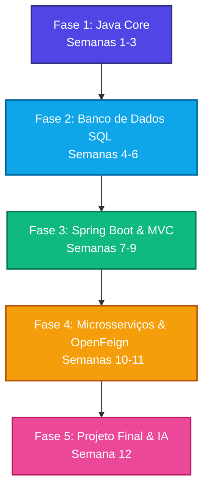

# 🚀 Santander Bootcamp 2026 — Planejamento Estruturado de Estudos
> **Trilha:** Java Back-end + Inteligência Artificial Generativa  
> **Foco:** Clean Architecture, Microsserviços, APIs REST Seguras, Whisper OpenAI e Google Gemini.

---

## 📊 1. Resumo Executivo (Status em 21/06/2026)

| Indicador | Informação / Data | Status / Progresso |
| :--- | :--- | :--- |
| 🚀 **Início do Bootcamp** | **01/06/2026** | Oficializado na Plataforma |
| 🏁 **Encerramento Oficial** | **23/08/2026** | Fim das correções e certificações |
| 📦 **Deadline de Entrega Final** | **16/08/2026** | **Com 1 semana de antecedência!** |
| 📅 **Data Atual** | **21/06/2026** | Fim da Semana 3 / Início da Semana 4 |
| ⏱️ **Dias Decorridos** | 21 dias | 25% do tempo total de bootcamp consumido |
| ⏳ **Dias Restantes até a Entrega** | **56 dias** | Tempo disponível para desenvolvimento ativo |
| 🎯 **Status Atual do Aluno** | **Fase 2 (Banco de Dados SQL)** | Semana 3 em conclusão hoje |
| ⚡ **Ritmo de Estudo Recomendado** | **18 a 25 horas semanais** | ~2.5h a 3.5h por dia |

> [!NOTE]
> Restam exatamente **56 dias (8 semanas de calendário)** para a entrega do projeto final (16/08/2026). Para cobrir as **10 semanas de conteúdo restantes** (Semana 3 a Semana 12) de forma eficiente, faremos uma compactação inteligente, integrando a modelagem do banco de dados relacional e a modelagem do projeto final já a partir desta próxima semana (Semana 4).

---

## 🎯 2. Visão Geral das Fases do Bootcamp

O bootcamp está dividido em **5 fases estratégicas**, desenhadas para te levar dos fundamentos do desenvolvimento Java até a integração de modelos avançados de Inteligência Artificial Generativa.

* **Fase 1: Java Core (Semanas 1-3):** Sintaxe básica do Java 21, Programação Orientada a Objetos (POO) e Java Collections Framework.
* **Fase 2: Banco de Dados SQL (Semanas 4-6):** Modelagem relacional com PostgreSQL, consultas SQL avançadas (joins, agregações), e mapeamento ORM com JPA e Hibernate.
* **Fase 3: Spring Framework (Semanas 7-9):** Injeção de dependências, criação de APIs REST seguras (Spring Security + JWT) e introdução à Clean Architecture.
* **Fase 4: Projetos Práticos & Integração (Semanas 10-11):** Comunicação entre serviços via Spring Cloud OpenFeign, tratamento de falhas e testes automatizados (JUnit/Mockito).
* **Fase 5: Projeto Final & IA (Semana 12):** Integração final do assistente por voz (Whisper + Gemini), conteinerização com Docker e deploy em produção.

---

## 📈 3. Painel de Controle de Prazos e Checklist de Progresso
> Use este checklist para monitorar seu andamento. Atualize o status para manter o controle se está dentro do prazo recomendado para concluir até **16/08/2026**.

- [x] **Semana 1 (01/06 a 07/06):** Ambientação e Java Estruturado ➔ *Concluído no Prazo*
- [x] **Semana 2 (08/06 a 14/06):** POO, Exceções e Collections ➔ *Concluído no Prazo*
- [ ] **Semana 3 (15/06 a 21/06):** Modelagem ER, PostgreSQL e SQL Básico ➔ **Prazo de Conclusão: 21/06 (Hoje!)**
- [ ] **Semana 4 (22/06 a 28/06):** SQL Avançado, JDBC e Escopo do Projeto Final ➔ **Prazo de Conclusão: 28/06**
- [ ] **Semana 5 (29/06 a 05/07):** JPA e Mapeamento ORM com Hibernate ➔ **Prazo de Conclusão: 05/07**
- [ ] **Semana 6 (06/07 a 12/07):** Spring Boot, Injeção de Dependências e REST Controllers ➔ **Prazo de Conclusão: 12/07**
- [ ] **Semana 7 (13/07 a 19/07):** Spring Data JPA, DTOs e Validação de APIs ➔ **Prazo de Conclusão: 19/07**
- [ ] **Semana 8 (20/07 a 26/07):** Spring Security, Autenticação JWT e Clean Architecture ➔ **Prazo de Conclusão: 26/07**
- [ ] **Semana 9 (27/07 a 02/08):** Testes Unitários/Integração (JUnit/Mockito) e Git Flow ➔ **Prazo de Conclusão: 02/08**
- [ ] **Semana 10 (03/08 a 09/08):** Microsserviços Feign e APIs Whisper + Gemini ➔ **Prazo de Conclusão: 09/08**
- [ ] **Semana 11 (10/08 a 16/08):** Docker, Deploy em Produção e **Entrega Final** ➔ **Prazo de Conclusão: 16/08 📦**
- [ ] **Semana 12 (17/08 a 23/08):** Gravação de Pitch de Portfólio e Revisão Técnica ➔ **Prazo de Conclusão: 23/08 🎓**

---

## 📅 4. Cronograma Semanal Detalhado (Semanas 1 a 12)

---

### ☕ Semana 1: Ambientação e Fundamentos Java Básico
* **Período:** **01/06/2026 a 07/06/2026**
* **Status:** ✅ Concluída
* **Foco do Aprendizado:** Configuração do ambiente e domínio da lógica estrutural no Java.
* **Tópicos Detalhados:**
  * Instalação e configuração do JDK 21 LTS e da IDE IntelliJ IDEA.
  * Estrutura de arquivos do Java, compilação via CLI (`javac` / `java`).
  * Variáveis, constantes, tipos de dados primitivos (`int`, `double`, `boolean`, `char`) e tipos wrapper.
  * Operadores aritméticos, lógicos e relacionais.
  * Estruturas condicionais: `if-else`, `switch-case` (incluindo as novas Switch Expressions).
  * Estruturas de controle de repetição: `for`, `while`, `do-while`.
* **Atividades Práticas:**
  * Desenvolvimento de pequenos programas no terminal (Calculadora Simples, Simulador de Financiamento).
* **Materiais e Referências:**
  * 📖 [Oracle Dev.java - Portal Oficial para Iniciantes Java](https://dev.java/learn/language-basics/)
  * 🌐 [Tutorial de Sintaxe Java - W3Schools](https://www.w3schools.com/java/)
  * 📖 [Guia de Configuração de Ambiente do IntelliJ IDEA](https://www.jetbrains.com/help/idea/installation-guide.html)

---

### 📦 Semana 2: Programação Orientada a Objetos (POO) e Collections
* **Período:** **08/06/2026 a 14/06/2026**
* **Status:** ✅ Concluída
* **Foco do Aprendizado:** Compreender e aplicar os pilares do paradigma orientado a objetos e a manipulação estruturada de listas e conjuntos.
* **Tópicos Detalhados:**
  * Conceito de classe, objeto, atributo e método.
  * Os 4 pilares da POO: Encapsulamento, Herança, Polimorfismo e Abstração.
  * Métodos construtores, métodos de acesso (getters/setters), palavras-chave `this` e `super`.
  * Interfaces vs. Classes Abstratas.
  * O ecossistema Java Collections: `List` (ArrayList), `Set` (HashSet), `Map` (HashMap).
  * Tratamento de exceções em Java (`try-catch-finally`, `throw`, Checked vs. Unchecked Exceptions).
* **Atividades Práticas:**
  * Modelar e programar um mini-sistema orientado a objetos de gerenciamento escolar ou biblioteca no terminal aplicando herança, interfaces e coleções.
* **Materiais e Referências:**
  * 📖 [Oracle Tutorials - Object-Oriented Programming Concepts](https://docs.oracle.com/javase/tutorial/java/concepts/)
  * 🌐 [Baeldung - Guide to Java Collections Framework](https://www.baeldung.com/java-collections)
  * 📖 [Oracle Dev.java - Guide to Exceptions in Java](https://dev.java/learn/exceptions/)

---

### 🗄️ Semana 3: Fundamentos de Banco de Dados Relacional e SQL Básico
* **Período:** **15/06/2026 a 21/06/2026 (Finalizando Hoje!)**
* **Status:** 🟡 Em andamento
* **Foco do Aprendizado:** Compreensão teórica e prática da modelagem de dados e escrita de queries relacionais.
* **Tópicos Detalhados:**
  * Introdução a Sistemas Gerenciadores de Banco de Dados (SGBD) relacionais, com foco no PostgreSQL.
  * Modelagem de Dados: Modelo Entidade-Relacionamento (MER) e diagramação (DER).
  * Regras de Normalização de Dados (Primeira, Segunda e Terceira Formas Normais - 1FN, 2FN, 3FN).
  * Linguagem SQL Básica:
    * DDL (Data Definition Language): `CREATE TABLE`, `ALTER TABLE`, `DROP TABLE`.
    * DML (Data Manipulation Language): `INSERT`, `UPDATE`, `DELETE`.
    * DQL (Data Query Language): consultas simples com `SELECT`, filtros com `WHERE`, operadores lógicos e `LIKE`.
* **Atividades Práticas:**
  * Mapear e desenhar o DER físico do banco de dados para a aplicação de Biblioteca e escrever os scripts SQL para criar as tabelas locais no PostgreSQL.
* **Materiais e Referências:**
  * 🌐 [Ferramenta Online dbdiagram.io para Modelagem Rápida](https://dbdiagram.io/)
  * 📖 [Tutorial Completo de PostgreSQL - postgresqltutorial.com](https://www.postgresqltutorial.com/)
  * 🌐 [W3Schools SQL Quiz and Lessons](https://www.w3schools.com/sql/)

---

### 🔗 Semana 4: SQL Avançado, Conexão com JDBC e Definição de Arquitetura do Projeto Final
* **Período:** **22/06/2026 a 28/06/2026**
* **Status:** ⏳ Pendente (Próxima Semana)
* **Foco do Aprendizado:** Unir banco de dados à lógica Java através do JDBC nativo e definir o plano de desenvolvimento do assistente virtual.
* **Tópicos Detalhados:**
  * SQL Avançado: Junções de tabelas (`INNER JOIN`, `LEFT JOIN`, `RIGHT JOIN`), agregadores (`GROUP BY`, `HAVING`) e subconsultas.
  * Transações relacionais: Propriedades ACID, controle de transações com `COMMIT` e `ROLLBACK`.
  * Introdução ao JDBC: Drivers de banco, `Connection`, `PreparedStatement`, `ResultSet`.
  * Padrão de Projeto Data Access Object (DAO) para separação da lógica de dados da lógica de negócios.
  * *Marco do Projeto Final:* Escopo detalhado do Assistente Virtual por Voz (fluxo do input do áudio à resposta do Gemini).
* **Atividades Práticas:**
  * Implementar uma classe DAO no projeto Java de biblioteca para ler e gravar dados diretamente no banco PostgreSQL local usando JDBC puro.
* **Materiais e Referências:**
  * 📖 [Baeldung - Guide to JDBC in Java](https://www.baeldung.com/java-jdbc)
  * 🌐 [PostgreSQL Docs - Transaction Isolation and Locks](https://www.postgresql.org/docs/current/transaction-iso.html)
  * 📖 [Refactoring.Guru - Design Pattern: Data Access Object](https://refactoring.guru/design-patterns)

---

### 🗺️ Semana 5: JPA e Hibernate - Mapeamento Objeto-Relacional (ORM)
* **Período:** **29/06/2026 a 05/07/2026**
* **Status:** ⏳ Pendente
* **Foco do Aprendizado:** Entender a abstração ORM com a especificação JPA para evitar a escrita manual de queries dentro das classes Java.
* **Tópicos Detalhados:**
  * O que é ORM e por que surgiu a JPA (Java Persistence API).
  * Anotações de Entidades: `@Entity`, `@Table`, `@Id`, `@GeneratedValue`, `@Column`.
  * Mapeamento de Relacionamentos: `@ManyToOne`, `@OneToMany`, `@OneToOne`, `@ManyToMany`.
  * Gerenciamento de Entidades via `EntityManager` e ciclo de vida do JPA (Managed, Transient, Detached, Removed).
  * Escrita de consultas orientadas a objetos com JPQL (Java Persistence Query Language).
  * Estratégias de busca de dados: Eager vs. Lazy Loading.
* **Atividades Práticas:**
  * Refatorar todo o sistema de Biblioteca para utilizar JPA/Hibernate, apagando as classes JDBC manuais e definindo as entidades anotadas.
* **Materiais e Referências:**
  * 📖 [Baeldung - Hibernate/JPA Guide](https://www.baeldung.com/learn-jpa-hibernate)
  * 🌐 [Documentação Oficial do Hibernate ORM](https://hibernate.org/orm/documentation/)
  * 📖 [Oracle Java EE Tutorial - Introduction to JPA](https://docs.oracle.com/javaee/7/tutorial/partpersist.htm)

---

### 🌱 Semana 6: Spring Boot - Fundamentos, IoC e REST Controller
* **Período:** **06/07/2026 a 12/07/2026**
* **Status:** ⏳ Pendente
* **Foco do Aprendizado:** Entrar no ecossistema Spring Boot, entendendo Inversão de Controle, Injeção de Dependências e roteamento HTTP simples.
* **Tópicos Detalhados:**
  * O framework Spring vs. Spring Boot.
  * Inversão de Controle (IoC) e Injeção de Dependências (DI): `@Component`, `@Service`, `@Repository`, `@Autowired`.
  * Criação de projetos e dependências com Spring Initializr e gerenciamento com Maven/Gradle.
  * Fundamentos de APIs REST: Roteamento HTTP, verbos (`GET`, `POST`, `PUT`, `DELETE`).
  * Construção de controladores REST com `@RestController` e `@RequestMapping`.
  * Captura de dados: `@PathVariable`, `@RequestParam`, `@RequestBody`.
* **Atividades Práticas:**
  * Criar o esqueleto do projeto do Assistente Virtual utilizando Spring Initializr, estruturando os primeiros controladores e métodos mockados.
* **Materiais e Referências:**
  * 📖 [Spring Boot Reference Guide - Documentação Oficial](https://docs.spring.io/spring-boot/docs/current/reference/htmlsingle/)
  * 🌐 [Spring Quickstart Guide - Building a RESTful Web Service](https://spring.io/guides/gs/rest-service/)
  * 📖 [Baeldung - Spring Boot Annotations](https://www.baeldung.com/spring-boot-annotations)

---

### 🛡️ Semana 7: Spring Data JPA e APIs REST Completas
* **Período:** **13/07/2026 a 19/07/2026**
* **Status:** ⏳ Pendente
* **Foco do Aprendizado:** Integrar o banco de dados de forma declarativa e criar rotas seguras e validadas com tratamento centralizado de erros.
* **Tópicos Detalhados:**
  * O projeto Spring Data JPA: interfaces `JpaRepository` e `CrudRepository`.
  * Query Methods e consultas personalizadas com `@Query`.
  * Padronização de entrada e saída com DTOs (Data Transfer Objects).
  * Validação de payload com Bean Validation (`@NotNull`, `@NotBlank`, `@Size`, `@Valid`).
  * Tratamento global de erros na API REST com `@RestControllerAdvice` e `@ExceptionHandler`.
* **Atividades Práticas:**
  * Desenvolver a API REST de biblioteca completa conectada ao PostgreSQL via Spring Data JPA com tratamento de erros robusto.
* **Materiais e Referências:**
  * 📖 [Spring Data JPA Reference Manual](https://docs.spring.io/spring-data/jpa/docs/current/reference/html/)
  * 🌐 [Baeldung - Spring Validation](https://www.baeldung.com/spring-boot-bean-validation)
  * 📖 [Baeldung - Error Handling for REST with Spring](https://www.baeldung.com/exception-handling-for-rest-with-spring)

---

### 🔒 Semana 8: Spring Security, JWT e Clean Architecture
* **Período:** **20/07/2026 a 26/07/2026**
* **Status:** ⏳ Pendente
* **Foco do Aprendizado:** Implementar segurança stateless para APIs bancárias/corporativas e organizar o código usando princípios de Arquitetura Limpa.
* **Tópicos Detalhados:**
  * Conceitos fundamentais de segurança de rede: criptografia de senhas com `BCryptPasswordEncoder`.
  * Filtros de segurança e regras de rotas públicas/privadas com o Spring Security.
  * Mecanismo de Autenticação Stateless por tokens JWT (geração, validação e expiração).
  * Arquitetura de Software: Introdução aos conceitos de Clean Architecture (Entities, Use Cases, Interfaces Controllers/Gateways, Infrastructure).
  * Isolamento da camada de negócio de frameworks e bibliotecas no Java.
* **Atividades Práticas:**
  * Proteger o backend do Assistente Virtual configurando o Spring Security com JWT e reorganizar o layout de pastas de acordo com a Clean Architecture.
* **Materiais e Referências:**
  * 📖 [Spring Security Documentation](https://docs.spring.io/spring-security/reference/index.html)
  * 🌐 [Baeldung - JSON Web Token (JWT) with Spring Security](https://www.baeldung.com/spring-boot-security-autoconfiguration)
  * 📖 [Resumo Prático de Clean Architecture em Java - Dev.to](https://dev.to/)

---

### 🧪 Semana 9: Testes Automatizados (Unitários e Integração) e Boas Práticas de Git
* **Período:** **27/07/2026 a 02/08/2026**
* **Status:** ⏳ Pendente
* **Foco do Aprendizado:** Garantir a estabilidade da API por meio da escrita de testes de software e dominar o fluxo de trabalho colaborativo em código.
* **Tópicos Detalhados:**
  * O importância dos testes de software.
  * Testes Unitários no Java 21 com JUnit 5.
  * Simulação de dependências de banco e APIs utilizando Mockito (`@Mock`, `@InjectMocks`, `when().thenReturn()`).
  * Testes de Integração de rotas REST com `@SpringBootTest` e `MockMvc`.
  * Git Avançado: Fluxo de branches Git Flow, boas práticas de Conventional Commits e Pull Requests.
* **Atividades Práticas:**
  * Escrever uma cobertura robusta de testes unitários e de integração para os casos de uso do Assistente Virtual.
* **Materiais e Referências:**
  * 📖 [JUnit 5 User Guide](https://junit.org/junit5/docs/current/user-guide/)
  * 🌐 [Mockito Official Site and Reference Docs](https://site.mockito.org/)
  * 📖 [Baeldung - Guide to Testing in Spring Boot](https://www.baeldung.com/spring-boot-testing)

---

### 🤖 Semana 10: Integrações de APIs de Inteligência Artificial com Spring Cloud OpenFeign
* **Período:** **03/08/2026 a 09/08/2026**
* **Status:** ⏳ Pendente
* **Foco do Aprendizado:** Utilizar clientes HTTP declarativos para consumir APIs externas de Inteligência Artificial e manipular as requisições de forma segura.
* **Tópicos Detalhados:**
  * O que são Microsserviços e comunicação externa HTTP.
  * Spring Cloud OpenFeign: Configuração do cliente HTTP declarativo e tratamento de timeouts e erros.
  * Integração com a API do Whisper (OpenAI): Envio de arquivos de áudio multipartes e recebimento de texto transcrito.
  * Integração com a API do Google Gemini: Envio de prompts de contexto e controle de persona (System Prompt).
  * Gestão segura de chaves privadas de API (`API_KEY`) utilizando o Spring Profile e variáveis de ambiente do SO.
* **Atividades Práticas:**
  * Desenvolver a camada de Adapters/Gateways do Assistente Virtual responsável pela comunicação externa com OpenAI e Gemini utilizando o OpenFeign.
* **Materiais e Referências:**
  * 📖 [Spring Cloud OpenFeign Reference Docs](https://docs.spring.io/spring-cloud-openfeign/docs/current/reference/html/)
  * 🌐 [OpenAI API Reference - Audio / Transcription (Whisper)](https://platform.openai.com/docs/api-reference/audio)
  * 📖 [Google Gemini API Docs - REST / Quickstart](https://ai.google.dev/gemini-api/docs/quickstart?lang=rest)

---

### 🐳 Semana 11: Integração Completa, Conteinerização com Docker e Deploy (Entrega Final!)
* **Período:** **10/08/2026 a 16/08/2026**
* **Status:** ⏳ Pendente
* **Foco do Aprendizado:** Costurar todo o fluxo da aplicação de voz, empacotar a aplicação em containers leves e publicar na nuvem.
* **Tópicos Detalhados:**
  * Integração do fluxo do Assistente: Áudio de Voz ➔ Whisper (Texto) ➔ Gemini (Intenção e Resposta) ➔ Banco Relacional (Persistência) ➔ Retorno da Resposta.
  * Criação de `Dockerfile` multiplataforma (Multi-stage build) para otimização de imagem Java.
  * Orquestração de containers com `docker-compose.yml` (App + PostgreSQL).
  * Deploy na Nuvem: Publicação da API em serviços como Railway ou Render.
  * Documentação profissional de APIs: Swagger/OpenAPI (`springdoc-openapi`) e README.md rico no GitHub.
  * **DEADLINE CRÍTICO DE ENTREGA: 16/08/2026**
* **Atividades Práticas:**
  * Dockerizar a aplicação final do Assistente Virtual, subir para produção na nuvem, gerar os endpoints no Swagger e realizar a submissão formal no portal DIO Santander.
* **Materiais e Referências:**
  * 📖 [Docker Docs - Reference and Installation](https://docs.docker.com/)
  * 🌐 [Springdoc-openapi Documentation](https://springdoc.org/)
  * 📖 [Railway Deployment Documentation](https://docs.railway.app/)

---

### 🎓 Semana 12: Ajustes Finais, Gravação de Pitch e Portfólio de Alta Performance
* **Período:** **17/08/2026 a 23/08/2026**
* **Status:** ⏳ Pendente (Buffer de Segurança)
* **Foco do Aprendizado:** Utilizar feedbacks de avaliadores para ajustes pontuais, organizar o portfólio técnico no LinkedIn e GitHub e preparar pitch comercial do projeto.
* **Tópicos Detalhados:**
  * Correções de bugs pós-entrega com base nos feedbacks recebidos dos instrutores.
  * Elaboração de um vídeo demonstrativo curto (Pitch do projeto de 3 a 5 minutos) focando no problema resolvido, Clean Architecture, Whisper + Gemini e escalabilidade.
  * Otimização do perfil do GitHub para recrutadores de grandes empresas de tecnologia e bancos (Santander, etc.).
  * Estudo e simulação de entrevistas técnicas de Java Back-end.
* **Atividades Práticas:**
  * Gravar e publicar o pitch do projeto no LinkedIn e GitHub. Configurar o repositório público com todas as instruções necessárias para rodar a aplicação via Docker localmente.
* **Materiais e Referências:**
  * 📖 [Como Estruturar um README Excelente no GitHub](https://github.com/othneildrew/Best-README-Template)
  * 🌐 [GeeksforGeeks - Top Java Technical Interview Questions](https://www.geeksforgeeks.org/java-interview-questions/)

---

## 🏆 5. Marcos Críticos e Deadlines

Mapeamento visual dos checkpoints mais importantes e dos prazos finais do bootcamp.

| Tipo | Marco / Entregável | Data Limite | Descrição |
| :---: | :--- | :---: | :--- |
| 🏁 | **Início do Bootcamp** | **01/06/2026** | Abertura oficial e ambientação |
| 🚀 | **Checkpoint 1 — Java Core** | **14/06/2026** | Conclusão das trilhas de lógica e POO |
| 🗄️ | **Checkpoint 2 — SQL + JDBC** | **29/06/2026** | Modelagem física e conexão Java-Banco de dados |
| 🌱 | **Checkpoint 3 — Spring Boot** | **19/07/2026** | API REST CRUD funcional rodando localmente |
| 🛡️ | **Checkpoint 4 — Testes & Segurança** | **02/08/2026** | API protegida com JWT e cobertura de testes automatizados |
| 🤖 | **Checkpoint 5 — Integração de IA** | **09/08/2026** | Conexão com Whisper e Gemini APIs |
| 📦 | **Entrega Final do Projeto** | **16/08/2026** | **Deploy do Assistente Virtual, Documentação e link no portal** |
| 🎓 | **Encerramento Oficial** | **23/08/2026** | Prazo máximo de revisões e emissão de certificados |

---

## 💡 6. Recomendações de Organização e Estudos

### ⏰ Distribuição de Carga Horária (20h semanais recomendado):
* **Segunda a Sexta-feira:** 2.5 horas por dia (totalizando 12.5 horas).
  * Foco: Absorção teórica (vídeos, documentação) e pequenos testes práticos na IDE.
* **Sábado e Domingo:** 4 horas por dia (totalizando 8 horas).
  * Foco: Desenvolvimento prático contínuo, refatoração de código e escrita de testes.

### 🤖 Alavancagem de Estudos com IAs Generativas:
* **Chatbots (ChatGPT/Gemini/Claude):** Utilize para sanar dúvidas teóricas.
* **Copilotos (GitHub Copilot):** Utilize na IDE IntelliJ para autocompletar códigos repetitivos de infraestrutura.
* **Agentes (Google Antigravity/Cursor):** Utilize para tarefas estruturadas complexas, como geração de testes unitários.

---
*Planejamento gerado em parceria com a IA Antigravity para potencialização de carreiras de tecnologia.*  
*Última modificação: **21/06/2026***